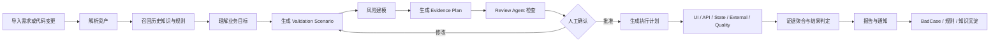
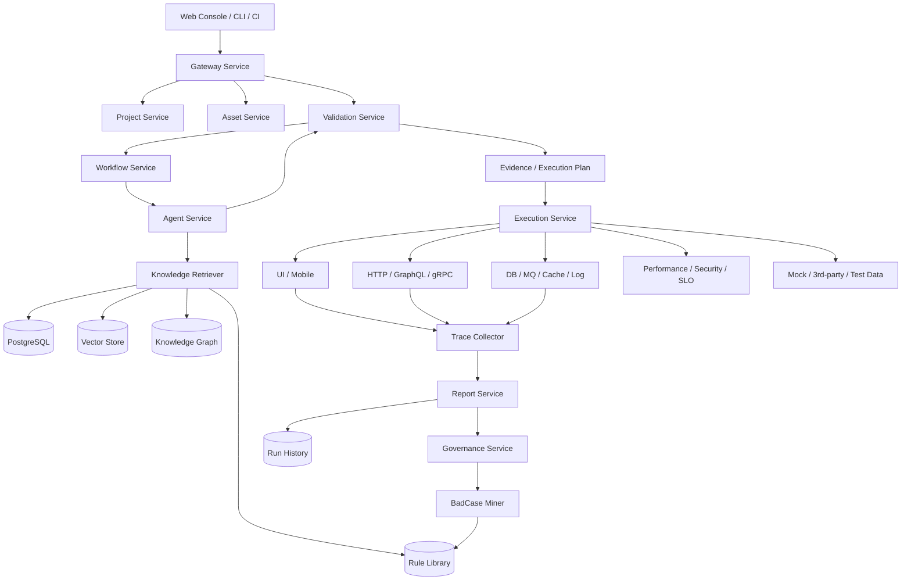
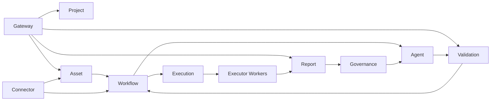
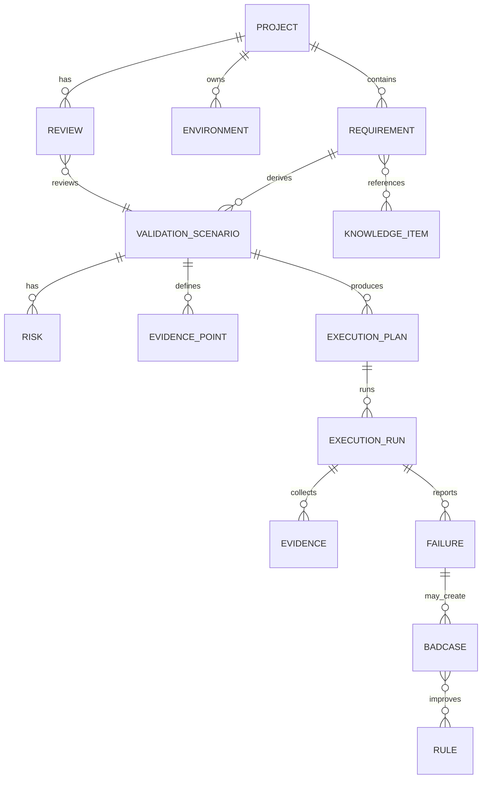
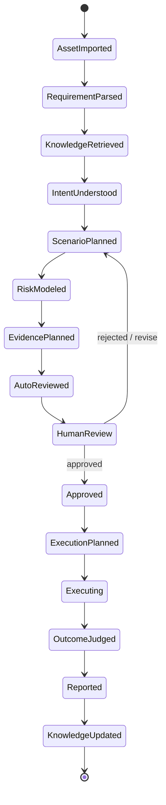
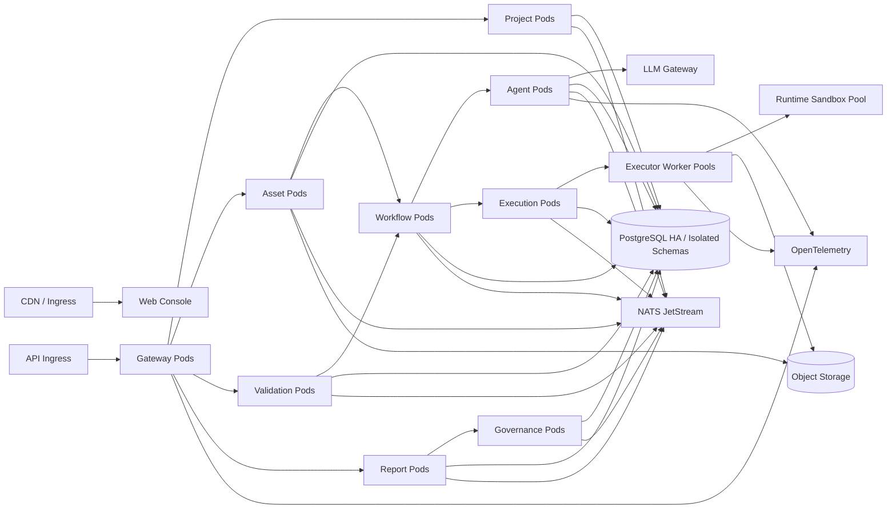

# OpenKATE 完整研发设计文档

> 版本：v0.1
> 日期：2026-07-14
> 依据架构：`/Users/lziam/Desktop/code/diagram/openkate-full-architecture/openkate-full-architecture.svg`
> 文档状态：研发基线

## 1. 文档目的

本文档定义 OpenKATE 开源智能测试平台的产品边界、系统架构、领域模型、Agent 工作流、执行器协议、数据模型、接口约定、部署方案和研发计划。

平台的核心对象不是单个接口用例或单个页面用例，而是一个可验证、可执行、可审计的业务验证场景：

```text
Business Intent
  -> Validation Scenario
  -> Evidence Plan
  -> Multi-channel Execution
  -> Outcome Judgment
  -> Report / BadCase / Rule Evolution
```

## 2. 设计假设与决策

### 2.1 假设

- 第一阶段面向中小团队和开源社区，优先支持 Web UI、HTTP API 和 Hybrid E2E。
- 平台既支持人工创建场景，也支持从 PRD、OpenAPI、Code Diff、历史缺陷中生成场景。
- LLM 不是判定真相的唯一来源；所有业务结论必须绑定可复核的证据。
- 执行环境默认是测试环境，生产环境仅允许只读检查或显式授权。
- 从第一版开始采用 `Monorepo + Multi-service`：代码统一管理，核心领域模块独立进程、独立容器、独立数据 Schema、独立发布。
- 多服务不等于细粒度微服务；服务边界按稳定业务域划分，避免分布式事务和无意义的内部 RPC。

### 2.2 关键决策

| 决策 | 选择 | 原因 |
| --- | --- | --- |
| 平台中心对象 | `ValidationScenario` | 对齐 AI 新范式，从单点检查转向业务结果验证 |
| 测试通道 | UI、API、State、External、Quality | 统一表达 UI、接口、数据状态、第三方和质量约束 |
| 编排方式 | 事件驱动 + 可恢复 Workflow | 支持长任务、重试、暂停 Review、异步执行 |
| Agent 输出 | 结构化 JSON，必须通过 Schema 校验 | 防止自然语言直接驱动执行器 |
| 结果判定 | 规则、断言、证据聚合优先；LLM 只做辅助归因 | 降低误判和不可审计风险 |
| 存储 | PostgreSQL + Vector Store + Object Storage | 分别承载业务实体、语义召回、文件和证据 |
| 第一版架构 | Monorepo + Multi-service + Worker Pool | 一开始固化服务和数据所有权，避免后续从单体拆分 |
| 服务粒度 | 1 个 Gateway + 9 个领域服务 + 按通道划分的 Executor Worker | 保留独立演进能力，同时限制分布式复杂度 |
| 数据边界 | PostgreSQL Cluster，共享基础设施但每个服务独占 Schema | 禁止跨服务直接读表，后续可无代码迁移为独立数据库 |
| 通信方式 | 短命令/查询用 HTTP/gRPC，长流程用 Workflow/Event Bus | 兼顾实时响应、可恢复性和服务解耦 |
| 开发语言 | 前端 TypeScript，后端 Python | 浏览器端保持类型安全，服务端、Agent、Workflow 和 Executor 统一 Python |

## 3. 产品范围

### 3.1 目标能力

- 项目、环境、成员和权限管理。
- PRD、Markdown、PDF、OpenAPI、GraphQL、代码 Diff、截图、HAR、历史缺陷接入。
- 需求解析、知识召回、业务目标理解和风险建模。
- 验证场景生成、人工 Review、证据计划生成和多通道执行计划生成。
- Web UI、HTTP API、GraphQL、gRPC、DB、MQ、Cache、Log、Trace、Metric 检查。
- Mobile、Performance、Security 执行器插件。
- 执行报告、截图、HAR、日志、Trace、Coverage 和失败归因。
- BadCase 标注、规则草稿、规则审批和知识自进化。
- CLI、SDK、CI/CD Trigger、Webhook 和第三方系统 Connector。

### 3.2 非目标

- 不在第一版实现完整的测试管理替代品。
- 不把 LLM 生成的自然语言直接作为可执行脚本。
- 不默认支持生产写操作。
- 不在平台内实现完整的 APM、日志平台、消息队列或密钥系统。
- 不将 Performance 和 Security 的底层引擎重新实现，采用成熟工具适配。

## 4. 用户角色与核心流程

### 4.1 角色

| 角色 | 主要职责 |
| --- | --- |
| Product Owner | 提供业务目标、验收标准和业务规则 |
| QA Engineer | Review 场景、维护证据、运行验证和标记 BadCase |
| Developer | 查看失败证据、接收 CI 结果和修复建议 |
| Platform Admin | 管理环境、连接器、模型、权限和执行配额 |
| AI Maintainer | 审批规则、Prompt、模型和知识更新 |

### 4.2 标准业务流程



## 5. 总体系统架构

架构图文件： [openkate-full-architecture.svg](/Users/lziam/Desktop/code/diagram/openkate-full-architecture/openkate-full-architecture.svg)

### 5.1 分层

| 层 | 组件 | 职责 |
| --- | --- | --- |
| 入口与协作层 | Web Console、CLI、SDK、CI/CD Trigger、Team Review | 创建任务、Review、查看报告、接入流水线 |
| 资产接入层 | PRD、API Spec、Code Diff、Prototype、Traffic、Defects、Connectors | 将外部材料统一转成平台资产 |
| 平台服务层 | API Gateway、Project、Task Orchestrator、Asset Service、Env Service、Validation Center | 权限、任务、资产、环境、场景生命周期 |
| Agent 智能层 | Intent、Requirement、Knowledge、Scenario Planner、Risk Model、Evidence Planner、Review、Plan Agent、LLM Gateway | 从非结构化输入生成可执行的验证计划 |
| 执行引擎层 | Execution Fabric、Business E2E、UI、Mobile、API、State、Quality、External、Runtime Sandbox | 多通道执行和环境隔离 |
| 反馈治理层 | Report Center、Trace Collector、Coverage、Failure Triage、BadCase Miner | 结果展示、证据收集、失败诊断和规则沉淀 |
| 数据与知识底座 | PostgreSQL、Vector Store、Rule Library、Knowledge Graph、Object Storage、Run History、Metrics Store、Secrets Vault | 持久化、召回、审计、指标、凭据和文件存储 |

### 5.2 逻辑数据流



### 5.3 多服务边界

从第一阶段创建以下独立应用。服务可以共享同一 Kubernetes Cluster 和 PostgreSQL Cluster，但不能共享业务代码入口、运行进程或私有数据表。

| 服务 | 代码模块 | 数据所有权 | 对外职责 |
| --- | --- | --- | --- |
| `gateway-service` | `services/gateway-service` | 无业务表，仅限流和幂等缓存 | Auth、RBAC、API 聚合、SSE、限流、审计入口 |
| `project-service` | `services/project` | Project、Environment、Member、Policy | 项目、环境、成员、权限、执行策略 |
| `asset-service` | `services/asset` | Asset、AssetVersion、ParseResult | 上传、解析、归档、Connector 输入标准化 |
| `validation-service` | `services/validation` | Requirement、Scenario、Risk、EvidencePlan、Review | 业务验证场景的唯一事实源 |
| `workflow-service` | `services/workflow` | Workflow、Task、StateTransition | 长任务编排、暂停、恢复、重试、补偿 |
| `agent-service` | `services/agent` | ModelRun、PromptVersion、KnowledgeSnapshot | Agent Workflow、LLM Gateway、结构化生成 |
| `execution-service` | `services/execution` | ExecutionPlan、Run、StepResult、Lease | DAG 调度、执行器匹配、变量和运行资源管理 |
| `report-service` | `services/report` | Report、EvidenceIndex、CoverageReadModel | 证据聚合、报告、Coverage、查询读模型 |
| `governance-service` | `services/governance` | Failure、BadCase、Rule、Approval | 失败归因、规则审批、自进化治理 |
| `connector-service` | `services/connector` | Connector、SyncCursor、WebhookDelivery | GitHub、GitLab、Jira、Figma、通知系统接入 |

执行通道采用独立 Worker 模块和部署单元：

```text
executor-ui-worker
executor-api-worker
executor-state-worker
executor-mobile-worker
executor-quality-worker
executor-external-worker
```

第一版只启用 UI、API、State，其他 Worker 保留统一协议和空能力注册，不创建无用实现。

### 5.4 服务通信规则

- `Gateway -> Domain Service`：HTTP/JSON；内部高频调用可使用 gRPC。
- `Workflow -> Agent/Execution`：Workflow command，不同步等待长任务完成。
- 跨服务状态传播：通过 Event Bus，事件采用 Outbox 写入并保证至少一次投递。
- 查询聚合：由 `report-service` 维护 Read Model，不允许前端跨服务拼接业务一致性。
- 服务不得跨 Schema 查询或创建数据库外键；关系通过稳定 ID 和领域事件维护。
- 同一个业务命令只能有一个 Owner；例如场景版本只能由 `validation-service` 修改。
- 所有消费者必须幂等，使用 `eventId` 或业务幂等键去重。
- 禁止分布式数据库事务；跨服务流程由 Workflow Saga 和补偿动作保证一致性。

### 5.5 服务依赖约束



依赖图不允许形成同步调用环。图中的闭环必须通过异步事件完成，例如 `Governance -> Agent` 表示发布规则事件，而不是同步 RPC。

## 6. 核心领域模型

### 6.1 对象关系



### 6.2 `ValidationScenario`

```json
{
  "id": "vs_checkout_001",
  "projectId": "project_ecommerce",
  "title": "用户完成一次商品购买",
  "businessIntent": "已登录用户能够完成购买，并在支付成功后看到可追踪订单",
  "actors": ["logged_in_user", "payment_service"],
  "preconditions": ["用户已登录", "商品库存大于 0"],
  "businessObjects": ["User", "Product", "Order", "Payment"],
  "riskLevel": "high",
  "invariants": ["支付成功不能生成无效订单", "订单金额等于商品金额减优惠金额"],
  "evidencePlanId": "ep_001",
  "executionPlanId": "xp_001",
  "status": "approved",
  "version": 3
}
```

### 6.3 `EvidencePoint`

证据点必须说明“观察什么、如何判断、失败后提供什么证据”。

```json
{
  "id": "ev_order_paid",
  "channel": "state",
  "target": "postgresql.orders",
  "observation": "查询订单状态和支付金额",
  "assertions": [
    { "path": "status", "operator": "equals", "expected": "PAID" },
    { "path": "pay_amount", "operator": "equals", "expectedFrom": "checkout.total" }
  ],
  "evidence": ["query_result", "trace_id", "order_id"],
  "required": true,
  "timeoutMs": 10000
}
```

### 6.4 `ExecutionPlan`

```json
{
  "id": "xp_001",
  "scenarioId": "vs_checkout_001",
  "steps": [
    { "id": "s1", "channel": "ui", "action": "login", "saveAs": "user" },
    { "id": "s2", "channel": "ui", "action": "buy_product", "saveAs": "checkout" },
    { "id": "s3", "channel": "api", "action": "payment_callback", "dependsOn": ["s2"] },
    { "id": "s4", "channel": "state", "action": "assert_order_paid", "dependsOn": ["s3"] }
  ],
  "parallelGroups": [],
  "rollback": ["cancel_order", "release_test_data"]
}
```

## 7. 模块设计

### 7.1 Web Console

页面域：

- `Workspace Overview`：项目、最近运行、失败趋势、证据覆盖率。
- `Validation Scenarios`：场景列表、状态筛选、风险筛选、批量运行。
- `Scenario Detail`：业务目标、前置条件、不变量、证据计划、执行计划、Review。
- `Run Detail`：步骤时间线、截图、请求响应、DB/MQ/Log/Trace、失败归因。
- `Knowledge & Rules`：文档、缺陷、规则、BadCase、审批和版本。
- `Connectors`：GitHub、GitLab、Jira、Figma、Feishu、Slack、TestRail。
- `Workspace Settings`：环境、模型、配额、成员、密钥引用和审计。

前端约束：

- 所有状态由后端返回，不能只依赖浏览器本地状态。
- 长任务通过 Server-Sent Events 或 WebSocket 更新。
- 场景、计划和报告必须显示版本号。
- 报告页面必须能反向跳转到场景、证据、原始输入和运行日志。

### 7.2 API Gateway

职责：认证、租户/项目边界、RBAC、限流、请求审计、幂等键、统一错误格式。

统一错误格式：

```json
{
  "error": {
    "code": "SCENARIO_VERSION_CONFLICT",
    "message": "scenario has been updated by another user",
    "requestId": "req_123",
    "details": {}
  }
}
```

### 7.3 Project Service

管理 `Project`、`Environment`、成员、角色、默认执行策略和项目级数据隔离。

环境至少包含：

- `baseUrl` 和服务地址。
- 浏览器、API、数据库、消息队列和第三方连接配置引用。
- 测试账号和数据集引用。
- 危险操作策略：禁止、只读、需审批、允许。
- 运行并发限制和超时策略。

### 7.4 Asset Service

统一接入并归档外部资产：

| 输入 | 解析结果 |
| --- | --- |
| Markdown / PDF PRD | 章节、用户故事、验收标准、业务术语 |
| OpenAPI | 服务、接口、参数、响应 Schema、鉴权 |
| GraphQL | Schema、Query、Mutation、类型关系 |
| Code Diff | 文件、函数、变更类型、影响范围 |
| Figma / Screenshot | 页面、组件、文案、交互线索 |
| HAR / Logs | 请求样本、链路、错误模式 |
| Jira / 禅道 | 缺陷、严重级别、复现步骤、修复版本 |

每个资产保留原始文件、解析版本、来源、Hash、项目和权限范围。

### 7.5 Validation Center

这是平台的业务中心，负责：

- 创建和版本化 `ValidationScenario`。
- 维护业务目标、参与者、前置条件和不变量。
- 绑定 Requirement、Knowledge、Risk、Evidence、Execution Plan。
- 管理 Draft、Review、Approved、Archived、Deprecated 状态。
- 记录每次修改的作者、原因和差异。

场景审批前不得进入 CI 阻断型执行；低风险自动生成场景可以进入建议队列，但不能默认自动发布。

## 8. Agent 智能层设计

### 8.1 Agent 总体原则

- Agent 只产生结构化中间结果，不直接修改生产数据。
- 每一步输出都通过 JSON Schema 和业务规则校验。
- 每个输出保存 `modelVersion`、`promptVersion`、`knowledgeSnapshotId` 和 `traceId`。
- Agent 失败可重试、可人工接管、可从中间状态恢复。
- 生成结果必须有来源引用，无法从输入或知识库解释的内容标为 `inferred`。

### 8.2 Agent 职责

| Agent | 输入 | 输出 |
| --- | --- | --- |
| `IntentAgent` | PRD、用户故事、Diff、接口变化 | 业务目标、参与者、成功结果 |
| `RequirementAgent` | 原始资产、解析结果 | 需求结构、术语、验收条件、影响范围 |
| `KnowledgeAgent` | 业务目标、项目上下文 | 历史缺陷、规则、用例、场景模板、引用 |
| `ScenarioPlanner` | 业务目标、知识、接口和页面 | 正常、异常、边界、补偿、权限场景 |
| `RiskModelAgent` | 场景、Diff、历史失败 | 风险、严重级别、不变量、风险覆盖 |
| `EvidencePlanner` | 场景、风险、系统边界 | UI/API/State/Trace/Metric 证据点 |
| `ReviewAgent` | 场景、证据、规则、来源 | 完整性、可执行性、冗余、幻觉和风险问题 |
| `PlanAgent` | Approved 场景、环境、执行器能力 | 多通道 DAG、变量绑定、超时、回滚 |
| `FailureTriageAgent` | 运行结果、Trace、日志、历史失败 | 失败分类、根因候选、置信度、建议动作 |
| `BadCaseMiner` | 失败运行、人工标注、Review 结果 | BadCase、规则草稿、知识更新建议 |

### 8.3 Agent Workflow



### 8.4 Review 规则

`ReviewAgent` 至少检查：

- 业务目标是否可判定。
- 正常路径和主要失败路径是否覆盖。
- 每个关键结果是否至少有一个证据点。
- 证据点是否能在当前环境和执行器能力下执行。
- 断言是否依赖未定义变量或脆弱的文本。
- 是否存在只验证页面成功、没有验证业务状态的空洞场景。
- 是否引用了正确的需求版本、规则版本和接口版本。
- 是否包含高风险操作和权限越界。
- 是否有重复场景、重复证据或无法解释的模型推断。

评分建议：

```text
scenario_quality =
  0.30 * business_goal_clarity
  + 0.25 * evidence_completeness
  + 0.20 * risk_coverage
  + 0.15 * executability
  + 0.10 * traceability
```

质量低于 `0.75` 时进入人工 Review；高风险场景即使分数达标也必须人工确认。

### 8.5 LLM Gateway

职责：模型路由、Provider 适配、超时、重试、成本统计、Prompt 版本、输出 Schema、敏感数据脱敏和调用审计。

模型路由策略：

- 解析和分类：低成本模型。
- 场景规划和风险建模：高质量模型。
- 失败归因：优先使用带工具调用和长上下文的模型。
- 敏感项目：支持本地模型或私有网关。
- 任意 Provider 不可用时，任务进入 `waiting_model`，不能静默产出空结果。

## 9. 知识与规则体系

### 9.1 知识类型

```text
historical_defect  历史缺陷
historical_case    历史用例
business_rule      业务规则
domain_glossary    业务术语
scenario_template  场景模板
execution_path     成功执行路径
badcase_rule       BadCase 规则
system_contract    接口 / 数据 / 事件契约
```

### 9.2 召回策略

采用混合召回，不只依赖向量相似度：

1. 项目、服务、业务域、环境等结构化过滤。
2. 关键词和实体召回。
3. 向量召回语义相似内容。
4. 图谱扩展关联对象、接口、页面和历史失败。
5. 按新鲜度、严重级别、人工确认状态和来源可信度排序。
6. 去重后注入 Agent 上下文，并记录召回快照。

### 9.3 规则生命周期

```text
BadCase / 人工反馈
  -> 规则草稿
  -> Review
  -> Approved
  -> Published
  -> 召回生效
  -> 评估命中率和误报率
  -> Deprecated / Revised
```

规则不能由失败运行直接自动发布。至少需要一名 QA 或业务负责人审批；高风险规则需要双人审批。

## 10. 执行引擎设计

### 10.1 Execution Fabric

`Execution Fabric` 负责把执行计划转换为可调度的运行 DAG：

- 能力匹配：检查场景需要的通道是否已安装和授权。
- 变量管理：跨 UI、API、State 传递 `token`、`orderId`、`traceId` 等上下文。
- DAG 调度：支持串行、并行、条件分支和重试。
- 隔离：为每次运行分配账号、数据、浏览器和连接资源。
- 取消和恢复：支持取消任务、从失败步骤恢复和重新运行单步。
- 回滚：执行结束后释放测试数据、撤销订单或恢复开关。

### 10.2 执行器协议

```python
from typing import Protocol


class TestExecutor(Protocol):
    type: ExecutorType

    def capabilities(self) -> list[ExecutorCapability]: ...

    def validate(
        self, step: ExecutionStep, context: RunContext
    ) -> ValidationResult: ...

    async def execute(
        self, step: ExecutionStep, context: RunContext
    ) -> StepResult: ...

    async def cancel(self, run_id: str) -> None: ...
```

`StepResult` 必须包含：状态、开始结束时间、输入摘要、输出摘要、断言结果、证据引用、错误分类和环境信息。

### 10.3 通道设计

| 通道 | 第一版 | 后续 | 主要证据 |
| --- | --- | --- | --- |
| `UI Channel` | Playwright Web | Visual、Trace | 页面截图、DOM、Trace、Console |
| `Mobile Channel` | - | Appium、Device Farm | 屏幕截图、设备日志、网络请求 |
| `API Channel` | HTTP、OpenAPI | GraphQL、gRPC | Request、Response、Schema、Trace |
| `State Channel` | PostgreSQL | MQ、Cache、Log | 查询结果、事件、日志、状态变化 |
| `Quality Channel` | - | k6、DAST、SLO | 延迟、错误率、漏洞、指标 |
| `External Channel` | Mock/Test Data | 第三方沙箱 | Mock 调用、数据快照、回调 |

### 10.4 Business E2E

`Business E2E` 不是另一个执行器，而是多通道结果聚合器：

- 将多个通道的步骤绑定到一个业务目标。
- 等待最终状态稳定，而不是只检查即时响应。
- 聚合 UI、API、State、Trace 和 Metric 证据。
- 对失败进行分层：动作失败、依赖失败、状态失败、断言失败、环境失败。
- 生成“业务结果是否达成”的最终结论。

## 11. 运行时与环境隔离

每次 `ExecutionRun` 都需要拥有独立的 `RunContext`：

```json
{
  "runId": "run_001",
  "projectId": "project_ecommerce",
  "environmentId": "staging_cn",
  "tenantId": "team_a",
  "accountLeaseId": "lease_001",
  "dataSetId": "checkout_seed_01",
  "traceId": "trace_001",
  "deadline": "2026-07-14T10:00:00Z"
}
```

隔离要求：

- 账号采用租约，运行结束自动归还或禁用。
- 测试数据有唯一前缀和归属 `runId`。
- 浏览器、设备和容器按运行隔离。
- 凭据只在 Worker 内存中短暂使用，日志不得输出原文。
- 跨项目访问必须由 API Gateway 和 Worker 双重校验。
- 危险动作使用 allowlist，不允许 Agent 自由拼接任意命令。

## 12. 数据库设计

开发和初期生产可以共用一个 PostgreSQL Cluster，但每个服务使用独立用户和独立 Schema。服务账号只拥有自身 Schema 权限，禁止跨 Schema SQL 和数据库外键。

### 12.1 Schema 所有权

```text
project_schema
  projects, project_members, environments, policies

asset_schema
  assets, asset_versions, parse_results

validation_schema
  requirements, validation_scenarios, scenario_versions,
  risks, evidence_points, reviews

workflow_schema
  workflows, workflow_tasks, state_transitions, outbox_events

agent_schema
  model_runs, prompt_versions, knowledge_snapshots, agent_outputs

execution_schema
  execution_plans, execution_steps, execution_runs,
  step_results, resource_leases

report_schema
  reports, evidence_indexes, coverage_snapshots, run_read_models

governance_schema
  failures, badcases, business_rules, rule_versions, approvals

connector_schema
  connectors, sync_cursors, webhook_deliveries
```

各服务的 migration 只允许修改自己的 Schema。将来若某一服务需要独立数据库，只迁移该 Schema 和事件消费位点，不需要重新拆分表所有权。

### 12.2 通用字段

```text
id, project_id, version, status, created_by, created_at,
updated_by, updated_at, source_refs, metadata, deleted_at
```

每个 Schema 均包含自己的 `audit_logs` 和 `outbox_events`，平台级审计由事件汇总到独立审计存储，避免一个共享审计表成为耦合点。

### 12.3 关键索引

- `validation_scenarios(project_id, status, risk_level)`。
- `execution_runs(scenario_id, created_at desc)`。
- `evidences(run_id, channel, status)`。
- `knowledge_items(project_id, type, approved_at)`。
- `audit_logs(project_id, actor_id, created_at desc)`。
- Vector Store 按 `project_id`、`domain`、`source_type` 做 metadata filter。

### 12.4 Object Storage 目录

```text
/{tenantId}/{projectId}/assets/{assetId}/source
/{tenantId}/{projectId}/runs/{runId}/screenshots
/{tenantId}/{projectId}/runs/{runId}/har
/{tenantId}/{projectId}/runs/{runId}/logs
/{tenantId}/{projectId}/runs/{runId}/reports
```

## 13. API 设计

API 版本统一以 `/api/v1` 开头。

### 13.1 场景 API

```text
POST   /projects/{projectId}/scenarios
GET    /projects/{projectId}/scenarios
GET    /scenarios/{scenarioId}
PATCH  /scenarios/{scenarioId}
POST   /scenarios/{scenarioId}/generate
POST   /scenarios/{scenarioId}/review
POST   /scenarios/{scenarioId}/approve
POST   /scenarios/{scenarioId}/runs
```

### 13.2 资产 API

```text
POST   /projects/{projectId}/assets
GET    /projects/{projectId}/assets
POST   /assets/{assetId}/parse
GET    /assets/{assetId}/versions
POST   /projects/{projectId}/connectors/{connectorId}/sync
```

### 13.3 运行 API

```text
GET    /runs/{runId}
GET    /runs/{runId}/events
POST   /runs/{runId}/cancel
POST   /runs/{runId}/retry
GET    /runs/{runId}/report
GET    /runs/{runId}/evidences
```

### 13.4 CI API

```text
POST /ci/projects/{projectId}/trigger
GET  /ci/runs/{runId}/status
POST /webhooks/{provider}/{projectId}
```

所有创建和运行接口支持 `Idempotency-Key`；所有异步接口返回 `taskId` 或 `runId`，前端通过事件流获取状态。

## 14. 任务状态与事件

### 14.1 Task 状态

```text
created -> queued -> running -> waiting_review -> approved
       -> waiting_model -> retrying -> succeeded
       -> failed -> canceled
```

终态只能是 `succeeded`、`failed` 或 `canceled`。状态迁移必须由服务端校验，不能由前端直接写入。

### 14.2 事件类型

```text
asset.imported
asset.parsed
knowledge.retrieved
agent.started
agent.output.created
review.required
review.completed
execution.started
execution.step.completed
execution.step.failed
evidence.collected
run.judged
report.generated
badcase.created
rule.draft.created
rule.published
```

事件必须包含 `eventId`、`eventType`、`projectId`、`aggregateId`、`occurredAt`、`traceId` 和 `payload`。

## 15. 报告与结果判定

### 15.1 结果层级

```text
Step Result       单个动作或检查是否成功
Evidence Result   某个证据点是否满足断言
Scenario Result   业务验证场景是否达成
Run Result        本次运行是否可接受
Quality Trend     一段时间内的质量变化
```

### 15.2 结果枚举

```text
passed
failed
blocked
skipped
inconclusive
flaky
environment_error
```

`inconclusive` 不得自动当成 `passed`。例如 UI 操作成功但数据库证据不可用，场景结果应为 `inconclusive` 或 `blocked`。

### 15.3 报告内容

- 业务目标和最终判定。
- 场景版本、需求版本、规则版本、模型版本和执行环境。
- 证据覆盖矩阵：目标、风险、不变量到证据点的映射。
- 执行时间线和跨通道变量流转。
- UI 截图、DOM、API 请求响应、DB/MQ/Log/Trace/Metric。
- 失败归因和置信度。
- Flaky 指纹和历史对比。
- HTML、JSON、JUnit XML 导出。

## 16. 失败归因与 BadCase

### 16.1 失败分类

```text
product_defect
test_plan_defect
environment_defect
dependency_defect
data_defect
executor_defect
flaky
unknown
```

### 16.2 BadCase 触发条件

- Agent 生成了不存在的页面、接口、字段或业务规则。
- 场景只检查表象成功，没有验证最终业务状态。
- 断言在正常情况下长期误报或漏报。
- 运行器执行步骤与场景意图不一致。
- Review Agent 漏掉已存在的高风险规则。
- 失败归因错误，且人工进行了修正。

### 16.3 自进化约束

- 自动生成规则草稿，不自动发布。
- 每条规则记录来源 BadCase、命中次数、误报次数和审批人。
- 规则发布前在历史运行集上回放，比较新增误报和漏报。
- 规则需要支持版本、回滚和禁用。

## 17. 权限、安全与合规

### 17.1 RBAC

```text
Owner       项目和设置全部权限
Maintainer  场景、规则、连接器和运行管理
Reviewer    Review、审批和 BadCase 标注
Developer   查看场景、触发运行、查看报告
Viewer      只读报告和趋势
```

### 17.2 安全要求

- API Token、Cookie、数据库密码和第三方凭据进入 `Secrets Vault`。
- LLM 调用前做字段级脱敏；返回结果做敏感信息扫描。
- Prompt、模型、输入摘要和输出 Hash 可审计，原始敏感内容按权限查看。
- Worker 使用最小权限 Service Account。
- 执行脚本、Browser Context、网络访问和文件读写都采用 allowlist。
- 所有外部 Webhook 验签，支持重放保护。
- 运行日志、报告和对象存储按项目隔离。
- 支持数据保留期、删除和导出。

## 18. 可观测性与运营指标

### 18.1 技术指标

- API P50/P95/P99 latency。
- Agent 成功率、重试率、Schema 校验失败率。
- 任务排队时间、运行时长、Worker 利用率。
- 各执行器成功率、超时率、取消率。
- Event Bus lag、死信数量和重复事件数量。
- LLM token、成本、延迟和 Provider 错误率。

### 18.2 产品指标

- 场景审批通过率。
- 证据覆盖率。
- 业务场景通过率和 `inconclusive` 比例。
- AI 生成场景人工修改率。
- BadCase 复现率和规则命中率。
- Flaky rate。
- 从需求导入到首次有效运行的时间。
- 失败归因正确率和人工接管比例。

### 18.3 目标值

| 指标 | MVP 目标 | 稳定版目标 |
| --- | --- | --- |
| 场景生成成功率 | >= 90% | >= 97% |
| Schema 校验通过率 | >= 95% | >= 99% |
| 证据覆盖率 | >= 70% | >= 90% |
| 非 Flaky 运行成功率 | >= 90% | >= 97% |
| 报告生成时间 | <= 30s | <= 10s |
| 任务状态丢失 | 0 | 0 |

## 19. 部署架构

### 19.1 开发环境

```text
Web Console
Gateway Service
Project Service
Asset Service
Validation Service
Workflow Service
Agent Service
Execution Service
Report Service
Governance Service
Connector Service
UI / API / State Executor Workers
PostgreSQL + pgvector
Temporal
NATS JetStream
MinIO
Playwright Browser
Local LLM Gateway / External LLM Provider
```

使用 Docker Compose Profile 管理多服务：`core` 启动控制面，`executors` 启动执行器，`ai` 启动 Agent。默认只暴露 Web 和 Gateway 端口，其他服务仅加入内部网络。

### 19.2 生产环境



生产部署按以下边界扩容：

- 每个领域服务独立 Deployment、Service Account、配置和发布版本。
- Gateway、Agent、Execution、Report 分别横向扩展，不共享进程。
- UI、Mobile、Performance、Security 使用独立 Worker Pool。
- Browser、Device Farm 和高风险执行环境放在隔离网络。
- PostgreSQL、Object Storage、Metrics 按保留策略分层存储。
- 服务间网络使用 NetworkPolicy，仅开放明确依赖。
- 服务级故障不得拖垮其他模块；Event Bus 和 Workflow 负责削峰与恢复。

## 20. 推荐技术栈

| 领域 | 推荐 | 说明 |
| --- | --- | --- |
| Frontend Language | TypeScript | 仅用于 Web Console 和生成的 API Client |
| Backend Language | Python | Gateway、领域服务、Agent、Workflow、Connector 和 Executor |
| Monorepo | uv Workspace + pnpm Workspace | Python 服务依赖和前端依赖分别统一管理 |
| Web | React / Next.js | 工作台、报告和流式状态 |
| Service Framework | FastAPI + Uvicorn | Gateway、领域服务、Connector 和 Worker 控制面 |
| Agent Runtime | Python + Pydantic Model Adapter | 结构化生成、Tool 调用、RAG、模型路由和评测 |
| Contract | Pydantic + OpenAPI + JSON Schema | 后端定义唯一事实源，自动生成 TypeScript API Client |
| Workflow | Temporal Python SDK | 跨服务长任务、暂停、恢复和 Saga |
| Event Bus | NATS JetStream Python Client | 领域事件、消费者组、重放和低运维成本 |
| Database | PostgreSQL | 主数据、审计和配置 |
| Data Access | SQLAlchemy + Alembic | 每个服务独立 Model、Repository 和 Migration |
| Vector | pgvector | 初期减少基础设施数量 |
| Object | S3 / MinIO | 原始资产和运行证据 |
| UI Executor | Playwright for Python | Web UI、截图和 Trace |
| Mobile Executor | Appium Python Client | 移动端执行器 |
| API Executor | httpx / OpenAPI Parser / grpcio | HTTP、GraphQL、OpenAPI 和 gRPC 检查 |
| Backend Test | pytest | 服务、Agent、契约、集成和执行器测试 |
| Frontend Test | Vitest + Playwright | 组件和 Web Console 端到端测试 |
| Observability | OpenTelemetry Python / Browser | Trace、Metric、Log 统一关联 |
| Quality Adapter | k6、OWASP ZAP | 作为外部执行引擎，不进入平台语言体系 |

### 20.1 语言与依赖约束

- `apps/web` 使用 TypeScript，禁止包含服务端领域逻辑和执行器逻辑。
- `services/*`、`workers/*`、CLI 和 SDK 主实现统一使用 Python，禁止各服务自行增加 Node.js 后端。
- 后端 Pydantic Model 是 API Schema 的唯一事实源，通过 OpenAPI 自动生成前端 TypeScript Client；禁止手工复制 Request/Response 类型。
- Event Contract 使用版本化 JSON Schema，并由 Pydantic Model 生成；生产者和消费者都运行契约测试。
- `executor-ui`、`executor-api`、`executor-state`、`executor-mobile` 使用同一个 `executor-sdk`。
- k6、OWASP ZAP、PostgreSQL、NATS、Temporal 和 MinIO 被视为外部引擎或基础设施，其实现语言不构成项目开发语言。
- Python 统一使用 `uv`、Ruff、mypy、pytest、Pydantic、OpenTelemetry 和结构化日志配置。
- TypeScript 统一使用 `pnpm`、TypeScript strict mode、ESLint、Formatter 和 Vitest。
- 根目录通过 Makefile 和 Docker Compose 提供统一的 `bootstrap`、`lint`、`test`、`build`、`up` 命令。
- 新增第三种业务开发语言必须经过架构评审，且不得进入核心调用链。

## 21. 仓库结构

```text
openkate/
  apps/
    web/
  services/
    gateway-service/
    project-service/
    asset-service/
    validation-service/
    workflow-service/
    agent-service/
    execution-service/
    report-service/
    governance-service/
    connector-service/
  workers/
    executor-ui/
    executor-api/
    executor-state/
    executor-mobile/
    executor-quality/
    executor-external/
  packages/
    python/
      domain-model/
      event-contracts/
      executor-sdk/
      observability/
      workflow/
      agent-core/
      knowledge/
      report/
      connectors/
    contracts/
      openapi/
      events/
    typescript/
      api-client/
  migrations/
    project/
    asset/
    validation/
    workflow/
    agent/
    execution/
    report/
    governance/
    connector/
  deploy/
    docker-compose.yml
    helm/
  docs/
  examples/
  tests/
```

### 21.1 包边界

- 各 `services/*` 是独立 Python 构建、测试、容器和发布单元，不能直接 import 另一个服务的内部代码。
- `packages/python/domain-model` 仅包含跨服务稳定值对象和枚举，不包含任何服务的聚合实现。
- `packages/contracts/openapi` 保存后端构建时导出的 OpenAPI，不手工维护接口类型。
- `packages/typescript/api-client` 根据 OpenAPI 自动生成，只供 Web Console 使用。
- `packages/python/event-contracts` 是事件 Pydantic Model；发布时同步生成 `packages/contracts/events` JSON Schema。
- `packages/python/executor-sdk` 定义执行器协议、能力注册和结果结构。
- `packages/python/agent-core` 只负责工具和结构化输出，不直接访问 UI 浏览器。
- `workers/*` 只实现执行器协议，不修改场景业务定义，也不能直接访问其他服务数据库。
- `packages/python/report` 只消费标准化运行结果。
- `packages/python/connectors` 只提供第三方适配协议，不把第三方字段泄漏到核心领域模型。

### 21.2 多模块构建约束

- Python 使用根目录 `uv.lock` 和 Workspace 管理依赖，每个服务拥有独立 `pyproject.toml`、Dockerfile 和启动命令。
- Web 使用独立 `package.json` 和 `pnpm-lock.yaml`，不参与后端 Python 依赖解析。
- CI 根据变更路径计算受影响模块，同时运行契约测试和依赖检查。
- 共享包只允许放稳定协议和基础设施适配，禁止把业务逻辑放进 `common` 包。
- Event 和 API Contract 使用语义化版本；破坏性变更必须提供并行版本和迁移窗口。
- 本地环境可以同时启动全部模块，也可以只启动某个服务及其依赖。

## 22. 测试策略

### 22.1 单元测试

- 领域状态机和版本冲突。
- Evidence assertion 运算符。
- DAG 依赖和变量绑定。
- 权限、脱敏和危险操作策略。
- Agent 输出 Schema 和规则校验。

### 22.2 集成测试

- API 与 PostgreSQL、Redis、Object Storage。
- Asset Parser 与样例 PRD/OpenAPI。
- Knowledge Retriever 与 pgvector。
- Workflow 中断、重试、恢复和幂等。
- 执行器与 Test Web、Mock API、Test Database。

### 22.3 端到端测试

至少建立一个完整的 `checkout` 示例：

```text
导入 PRD
  -> 生成购买场景
  -> Review 并批准
  -> UI 登录和下单
  -> API 模拟支付回调
  -> State 查询订单为 PAID
  -> 生成截图、请求、查询结果和最终报告
  -> 标记一次 BadCase 并生成规则草稿
```

### 22.4 Agent 评测集

建立固定数据集，评估：

- 业务目标提取准确率。
- 场景完整性和重复率。
- 证据点可执行率。
- 高风险规则召回率。
- 幻觉率。
- 人工修改率。
- 失败归因准确率。

模型、Prompt 或规则变更必须先跑评测集，再允许发布。

## 23. 验收标准

### 功能验收

- 用户可以创建项目、环境和验证场景。
- 场景包含业务目标、风险、不变量和证据计划。
- 场景可以拆成 UI、API、State 多通道执行步骤。
- 运行期间可以看到步骤状态和证据。
- 运行结束生成 `passed`、`failed`、`blocked` 或 `inconclusive` 结论。
- 失败可以查看原始证据并标记 BadCase。
- BadCase 能生成待审批规则草稿。
- CI 可以触发场景运行并获取 JUnit 结果。

### 非功能验收

- 任务状态不丢失，重复事件不会重复执行步骤。
- 运行凭据不出现在日志和报告中。
- Agent 输出不能绕过 Schema 和 Review 直接执行高风险动作。
- 场景、计划、模型、Prompt、规则和证据均可追溯。
- 执行器可通过插件方式增加，不修改核心领域模型。
- 本地开发环境可以通过 Docker Compose 启动。

## 24. 当前 MVP 到目标架构的映射

当前 `openkate-platform` 是纯前端演示层，已表达以下产品概念：

| 当前 MVP | 目标架构 |
| --- | --- |
| 场景列表 | Validation Center |
| 业务意图 | Intent Agent 输出 |
| UI/API/State 标签 | Execution Fabric 通道 |
| 证据计划 | Evidence Planner 输出 |
| 运行按钮 | Execution Run 创建 |
| 运行记录 | Run History |
| 待 Review | Review Agent + Team Review |
| 失败状态 | Failure Triage + BadCase Miner |

下一步研发不应继续堆叠静态页面，而应先实现后端领域模型和 `POST /scenarios/{id}/runs` 的真实运行链路，让当前工作台从演示数据切换到真实状态。
